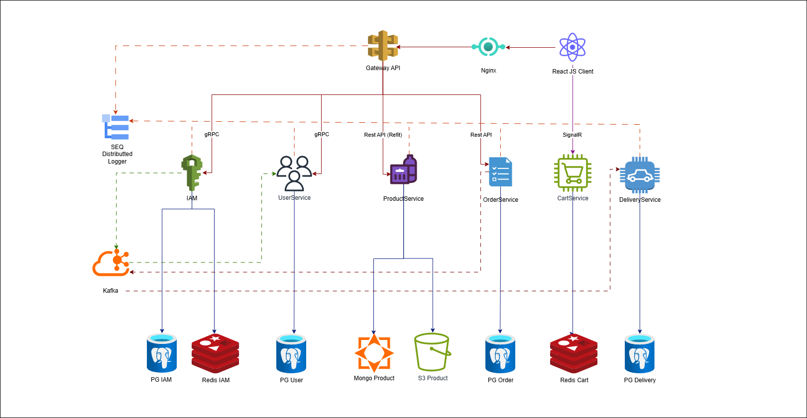

# Marketplace s3ng

## 🔖 О проекте
**Marketplace s3ng** — это учебный проект по курсу Otus ASP.NET, реализующий логику работы маркетплейс (интернет магазина) на базе микросервисной архитектуры.

## 🛠️ Архитектура проекта


### Основные компоненты:
- **WebHost** (API Gateway) - центральная точка входа для пользовательских запросов.
- **IAMService** - сервис для аутентификации и авторизации.
- **UserService** - сервис для работы с информацией о пользователях.
- **ProductService** - сервис для работы с товарами.
- **OrderService** - сервис для работы с заказами.
- **DeliveryService** - сервис для работы с доставкой.

## ⚡️ Как начать работать с проектом

### Требования:
- .NET 8.0 SDK
- Docker

### Как конфигурировать проект
Список переменных окружения для настройки можно найти в `.env.example`.

### Запуск:
```bash
# Клонируйте репозиторий
git clone https://github.com/KirillFave/s3ng.git
cd s3ng

# Создайте .env файл и укажите переменные среды (ENV)
cp .env.example .env

# Соберите и запустите сервисы
sudo docker-compose up --build
```

## 👨‍💻 Команда проекта
- **Косинов Кирилл** - Backend Developer, [Telegram](https://t.me/youngfave)
- **Мальцев Артур** - Backend Developer, [Telegram](https://t.me/Berrcir)
- **Ягафаров Роман** - Backend Developer, [Telegram](https://t.me/rr0112000)
- **Иванов Владлен** - Backend Developer, [Telegram](https://t.me/vivarov)
- **Пономарь Дмитрий** - Backend Developer, [Telegram](https://t.me/dmitrytoo)

## 👔 Лицензия
Проект **Marketplace s3ng** выпущен под лицензией MIT.